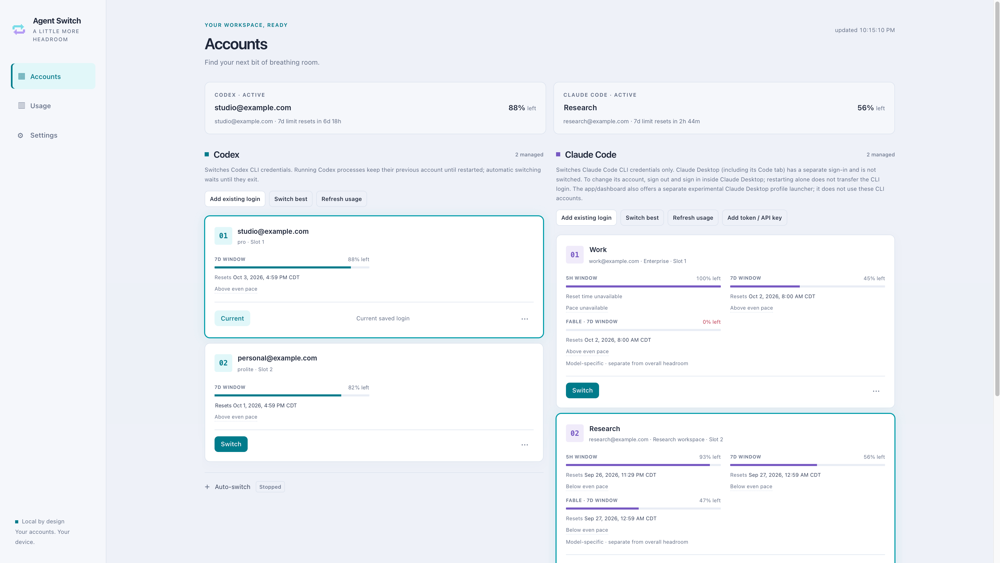
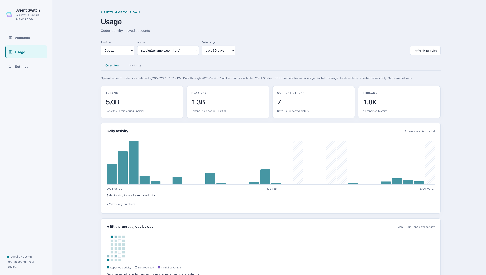
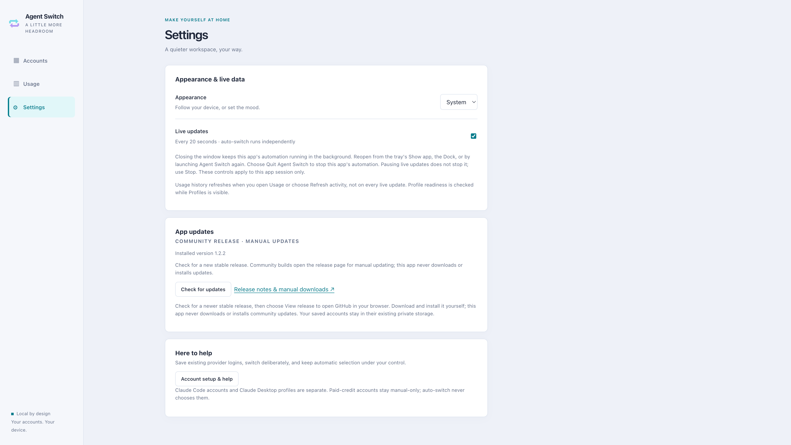

# Agent Switch

A local account manager for **Claude Code and Codex**. Save existing logins,
see quota and activity, and choose which account to use from a desktop window, browser
dashboard, or terminal. Automatic switching is optional.

**Start here:** [For humans](#for-humans) · [For agents](#for-agents)

The executable is **`agent-switch`**; the Python package is `agents-switcher`.

## For humans

### What Agent Switch adds

Work developed in this repository includes:

- **A standalone desktop app** with native menus, keyboard shortcuts, tray icons,
  and macOS, Windows, and Linux packaging. Its bundled runtime needs no separate
  Python or Node.js installation. Community releases provide a deliberate check
  that reports availability and a separate **View release** action; a future
  signed channel may also offer explicit download and install-and-restart
  controls.
- **A shared account workspace** across the desktop app, browser dashboard, and
  terminal UI, with manual account management and opt-in automatic switching.
- **Codex account support** with rotation-safe credential handling, quota and
  activity reports, live-login detection, and quit-first switching. Eligible Mac
  installs offer a guided normal quit, switch, and reopen sequence.
- **A pixel-neon dashboard** with light/dark themes, readable usage charts,
  activity heatmaps, Codex account reports, and local Claude Code Overview and
  Models views. Unknown data stays unknown rather than appearing as zero.
- **A matching terminal workspace** with mint/violet accents, light/dark themes,
  clear current-account cards, and keyboard navigation that adapts to narrow
  terminals without hiding provider warnings or confirmation controls.
- **Experimental Claude Desktop profiles** for separate local workspaces on
  macOS/Linux, with consent and process checks. These remain separate from CLI
  account switching; signed-in persistence and Code/Cowork behavior are unverified.
- **Shared safety infrastructure**, including cross-node-safe locking, serialized
  credential actions, native TLS trust, and packaged-backend checks.

### Screenshots

**Dark mode — accounts and quota at a glance.**


**macOS in light mode — your accounts, side by side.**
The Mac captures use anonymized emails and account labels; the second Codex
account shows simulated quota data.



**Usage — daily activity, totals, and reporting coverage.**



**Settings — choose your appearance and check for updates when you want.**



To get started, [get the desktop app](#get-the-app), or
[install the CLI from source](#install-the-cli-from-source). Save your current
provider login with **Add existing login** in Agent Switch, or use
[Codex browser sign-in](#save-and-switch-codex-accounts-safely) in a current source
build. Add another Codex account without signing in over the current login.

### What it switches

| Provider | Supported today | Boundary |
| --- | --- | --- |
| Claude Code | Saved CLI logins, setup tokens and managed API keys; manual and quota-based switching | **Not Claude Desktop**, including its Code tab. Desktop has a separate sign-in; restarting it does not transfer a CLI login. |
| Codex | File-backed ChatGPT/OAuth accounts, quota, activity stats and automatic selection | Supports Codex CLI and Desktop when they use the same `auth.json`, not keyring-only or API-key logins. Quit both before switching; running processes keep their old account until restarted. |
| Claude Desktop profiles | Experimental, manual launcher for separate local profiles on macOS/Linux | Sign in inside each profile. Mac account persistence and Code/Cowork behavior are unverified; custom profiles disable local Claude-in-Chrome pairing. No quota-based switching or Windows support. |

Agent Switch does not install provider apps. Sign-in happens through the official
provider. For Claude Code,
install its [CLI](https://code.claude.com/docs/en/setup). For Codex, use the
Desktop app or
[CLI](https://developers.openai.com/codex/cli) with a file-backed login; the Codex
CLI is not required for a supported Desktop login or the new browser sign-in
flow. **Add existing login** saves the current provider login;
it is not a login button. Claude API-key accounts have no subscription quota
readout and can incur per-token charges.

### Get the app

Download the [latest community release](https://github.com/jingyi-jia/agents-switcher/releases/latest)
for your platform and architecture. The community distribution is
public without paid Apple or Windows signing credentials; a separate signed
distribution remains a future, optional path. Draft artifacts and package
versions are not published downloads.

Independent storage/import and isolated terminal Codex sign-in require
**v1.2.4 or later**, or a current source build. The browser-only GUI/TUI sign-in
flow described below is a **source-build change, not part of the published
v1.2.4 installers**. Those installers still use Prepare sign-in, a generated
terminal command, and Save & switch. The v1.2.3 installers use the earlier shared
store and do not include isolated sign-in. Check the release notes before
downloading; repository documentation is not proof of a new binary release.

For developers, successful runs of
[Desktop installers](https://github.com/jingyi-jia/agents-switcher/actions/workflows/desktop.yml)
provide preview artifacts for macOS arm64/x64, Windows x64 and Linux x64.
Artifacts expire after **14 days**. macOS previews are **ad-hoc signed, not
Developer ID signed or notarized**; Windows and Linux previews are unsigned.
Gatekeeper or SmartScreen may block them. Do not disable OS protections to make
a preview run. See the [desktop guide](desktop/README.md) for preview handling,
platform requirements and native build instructions.

The standalone app bundles Electron and its Python backend: end users do not
need Python, uv, Node.js or npm. You still need the provider app or CLI and a
supported login, as described above.
The experimental Claude Desktop panel needs the official Claude Desktop app
instead of a CLI installation.
The optional signed distribution requires signing credentials, and macOS also
requires notarization. Community macOS releases are free ad-hoc-signed
installers, while community Windows releases are unsigned installers. Linux
community releases retain the AppImage, deb, and tar formats. Community releases
do not offer executable download or self-install, and do not silently fall back
to unsigned artifacts when a signed build was explicitly requested. Fresh native
installation checks are still required for every release; CI helper checks are
not proof of that.

### Update the standalone client

In a community release, open **Settings → App updates** (or **Help → Check for
Updates…**) and choose **Check for updates**. The check is user-initiated and
uses only this project's fixed public GitHub repository. It reports whether a
release is available; it does not open a browser. If a release is found, choose
**View release** separately to open the corresponding published release in your
browser and download it yourself. The app never downloads an executable or
self-installs from this flow, and it never performs automatic checks.

A release page is not proof that its artifacts are safe: review the publisher
and verify the published checksum and provenance before installing.

Nothing downloads or installs automatically, including when you normally quit
the app. A failed check is shown as a failure, not as a successful update.

| Installation | In-app update support |
| --- | --- |
| Community macOS | Manual release-page installation of the ad-hoc-signed arm64 or x64 installer. This is not Developer ID signing or notarization. |
| Community Windows | Manual release-page installation of the unsigned installer. Windows publisher verification is unavailable. |
| Community Linux | Manual installation of the AppImage, deb, or tar release. |
| Future signed release | A separate signed mode may support explicit download and install after strict signature checks and confirmed clean shutdown. It must fail closed when credentials or verification are missing. |
| Browser launcher, CLI, or TUI | These do not update the standalone client. Update your source installation separately. |

An older preview needs a **manual installation** from the published release page.
The community flow cannot add an updater to an existing installation. The
ordinary app quit never installs an update in either mode.

### Community release verification and platform warnings

Community artifacts are accompanied by SHA256 checksums and GitHub provenance
attestations when the release workflow completes. Anyone can verify an
attestation without a paid GitHub plan, for example:

```bash
gh attestation verify Agent-Switch-<version>-linux-x86_64.AppImage \
  --repo Jingyi-Jia/agents-switcher
```

Check that the attestation names the expected release/build workflow, reviewed
`main` source, and intended distribution before trusting it. The builder may be
reusable, so do not rely on a display name alone.
An attestation proves claimed build provenance, not safe code or reproducible
native binaries; a checksum alone proves neither publisher identity nor safety.

macOS community builds are ad-hoc signed and non-notarized. If Gatekeeper offers
it, follow Apple's official [Open Anyway instructions](https://support.apple.com/en-us/102445)
only after choosing to trust the verified official download. Windows may show
SmartScreen; where offered, select **More info → Run anyway** only after choosing
to trust the verified official download. These warnings can recur, and
SmartScreen, Smart App Control (SAC), Windows Defender Application Control, or
enterprise policy can block execution with no per-app override. Never disable
Gatekeeper, antivirus, or SmartScreen/Application Control, and never remove
quarantine attributes. A
damaged, malware, or unexpected-signature alert needs investigation rather than a
bypass.

### Install the CLI from source

Use Python 3.12+ and [uv](https://docs.astral.sh/uv/):

```bash
git clone https://github.com/jingyi-jia/agents-switcher.git
cd agents-switcher
uv tool install .
agent-switch --help
```

Alternatively, use `uv sync --locked` in the checkout and prefix commands with
`uv run agent-switch`. This is a source installation, not a promise of a published
PyPI package or signed desktop download.

Choose an interface:

```bash
agent-switch tui          # terminal provider chooser
agent-switch claude tui   # Claude Code accounts
agent-switch codex tui    # Codex accounts
agent-switch web          # local browser dashboard; Ctrl-C stops its server
agent-switch web --no-open
```

The TUI uses the desktop's restrained pixel-neon palette, with a separate action
rail in wide terminals and a stacked, scrollable layout in narrow ones. From the
dashboard, use **↑/↓ and Enter** for actions, **s** to switch, **w** to watch,
**p** to choose a provider, and **Ctrl+T** to change the theme. **Tab** moves focus
between actions and account details; **Esc** goes back. Quota values remain
percentages **used**, with unknown and error states kept distinct from zero.
Use a UTF-8 terminal with true-color support for the full palette.

<details>
<summary>Terminal previews — synthetic accounts</summary>


</details>

`agent-switch app install` creates a shortcut that runs `agent-switch web`;
it is **not** the standalone Electron app and still needs the CLI installation.
`agent-switch app uninstall` removes that shortcut. `agent-switch tray` provides
a menu-bar/system-tray readout when the optional platform dependency is installed
(`uv tool install '.[tray-macos]'` on macOS, `uv tool install '.[tray]'` elsewhere).

### Accounts, Usage, and Settings

**Accounts** is the everyday switching view. It keeps the selected login, current
5-hour/weekly capacity, reset times, and switching controls together. Account
management and automatic-switch settings remain separate from the primary switch
action. An unavailable measurement is not zero remaining quota.

Each quota window shows its reported reset date, time, and local timezone.
Relative resets stay anchored to the original usage report, not the time you
refresh the page. Missing or inconsistent timing stays unavailable; an elapsed
reset asks for fresh usage rather than assuming that quota has returned.
The subtle even-pace hint compares the displayed quota used with the share of
the window elapsed when that usage was measured. It stays visible between
refreshes without a separate age cutoff, as long as the reported window has not
reset. Failed updates, invalid timing and paid-credit samples still hide the
comparison. It is only a guide, never a forecast or an automatic-switching input.

**Live updates** is enabled by default and checks the dashboard every 20 seconds.
Actual Claude quota requests follow the shared polling schedule: normally about
3–5 minutes for the active account and up to 10 minutes for idle accounts, with
longer waits after rate limiting. **Refresh usage** checks immediately but still
respects that schedule and retry delays; it does not force a new provider request
on every click. Automatic switching is a separate, opt-in control.

When Claude reports exactly zero 5-hour usage, the card says **No session usage
reported** until a known reset passes. Without a usable reset, it says **Session
clock not reported** rather than implying an error. A displayed **100% left** alone
does not prove the session hasn't started: the percentage is rounded, and a
reported reset time remains visible.

When Claude reports a model-specific weekly limit, such as **Fable**, its account
card shows a separate bar and reset time. This is that model's allowance, not the
account's overall headroom; it does not change the dashboard's automatic-switch
policy. No model bar is invented when the provider has not reported one.

Open **Auto-switch**, enter a used-quota threshold for the most-used quota window,
and choose **Start**. Starting requires confirmation; **Stop** stops
that app/server session's automation. **Preview without switching** is optional:
it shows selection decisions without switching accounts, but usage checks can
still refresh credentials. Closing a browser tab does not stop its server.

**Usage** shows reporting data, not a second automatic-switch policy:

- **Codex:** account-specific statistics reported by OpenAI, including daily
  activity, lifetime totals, and available activity insights. Filter by account
  and reported date range. Statistics can lag behind current quota, and the
  provider does not supply every field for every account. Missing data is not
  recorded as zero. The underlying endpoint is not a published stable API.
- **Claude:** local Claude Code activity from `stats-cache.json` beneath the
  configured Claude directory (`~/.claude` by default). Overview and model views
  use the history already recorded there; Agent Switch does not scan conversation
  content, run Claude commands, or modify Claude's cache. This is this device's
  configured history, not a verified per-login total. Switching accounts does not
  reassign that history to the new login. The cache can stop at the previous day;
  current-session activity is not reconstructed. If it is missing or stale, open
  `/usage` in Claude Code and then choose **Refresh activity** here.

Data-through dates and stale/unavailable states explain the coverage of the
charts. Reported token counts, subscription quota percentages, and billing credits
are different quantities; the charts do not convert tokens into a subscription
bill or add different providers' quota percentages together. Claude Desktop has
no separate analytics dashboard.

**Settings** contains appearance and view preferences. System, light, and dark
appearance and acknowledgement of the profile notice persist in the private
`ui-preferences.json` file under Agent Switch's data directory. This file contains
no credentials. Closing the window hides the app while its backend and automatic-switching session keep running. Reopen it from the tray/menu bar, the macOS Dock, or by launching Agent Switch again. Choose Quit Agent Switch to stop its backend and automatic switching.

The native **View** menu and menu-bar menu open Accounts, Usage, and Settings.
Keyboard shortcuts are **⌘/Ctrl+1**, **⌘/Ctrl+2**, and **⌘/Ctrl+,** respectively.

### Save and switch Claude Code accounts

Sign in to Claude Code, then save that login. Repeat after signing in to each
additional account through Claude Code.

```bash
agent-switch claude add --alias work
agent-switch claude list
agent-switch claude status
agent-switch claude switch 2
agent-switch claude switch --strategy best
```

Unqualified commands such as `agent-switch list` and `agent-switch switch 2`
are Claude Code shortcuts. `disable 2` excludes a saved account from automatic
selection; `enable 2` restores eligibility. Neither deletes the saved login.

For setup tokens or managed API keys, use `agent-switch add-token` and its hidden
prompt rather than putting a secret in shell history. Experimental
`agent-switch run 2 -- --resume` launches a Claude Code account in a separate
terminal profile; it does not support API-key accounts and is not Desktop
profile switching. See `agent-switch run --help` for isolation and sharing options.

### Claude Desktop profiles

Use the **Claude Desktop — Profiles** panel in the app or browser
dashboard. It is not the Claude Code account list, and **Add existing login** does
not import a Desktop session.

1. Install official Claude Desktop in `/Applications/Claude.app` or
   `~/Applications/Claude.app` on macOS, or its official Linux package at
   `/usr/bin/claude-desktop`. Custom install locations and Windows are not supported.
2. Choose **+ New profile** at the end of the list, give it a name such as “Work”
   and an optional email label, and acknowledge the profile limitations.
   These are your labels, not a verified sign-in. This only creates empty private directories;
   it works even if Claude is not detected or its process status is unknown.
   Those checks block opening profiles, not creating them.
3. Fully **quit Claude Desktop**. Closing its window may leave it running. Once
   the app detects that Claude has quit, choose **Open** beside the profile.
   The first-use acknowledgement is remembered; later launches open with one click.
   Every launch remains deliberate, and the current process state is checked again before opening.
4. Sign in directly inside Claude. Repeat with another empty profile for another
   account. To return to a saved profile, quit Claude first and open that profile
   from Agent Switch. **Verify the selected account inside Claude before working**;
   labels are yours, not identities checked by Agent Switch.
5. To use your original profile again, quit Claude and choose **Open Claude**
   at the top of the panel. Launching Claude normally from the Dock also uses its usual profile,
   not the last named profile chosen here.

If **Open** is disabled, read the status box above it. A running Claude app must
be fully quit with **⌘Q** on Mac. If Claude is not
detected, move the official app into one of the supported installation locations
above, then choose **Refresh**. A failed process check or unreadable profile registry also blocks launch;
creating a profile does not bypass those checks.

Click a profile's name to edit its name or optional email label, or to
**Remove profile**. Removing takes the profile off the list at once and deletes
nothing: its folder, with Claude's local history and sign-in, stays on this
computer, and **Undo** in the notice puts it back. It works even while Claude is
running. Later, **+ New profile** with the same email label (or, for a profile
removed without one, the same name) offers **Restore history**, which brings the
profile back under the new labels with its original folder. **Start fresh**
creates an empty profile instead and keeps the removed one. Matching uses your
labels only, so check the account inside Claude after restoring. The usual
profile cannot be renamed or removed here.

This uses Claude's `--user-data-dir` launch flag without copying session cookies,
importing tokens, changing CLI credentials, modifying the official app, or
force-quitting it. The feature only confirms that a launch was requested, not
successful authentication. Account sign-in, expiry and refresh remain Claude's
responsibility. Opening profiles does not provide quota data or auto-switching.

**Known limitation:** the inspected Mac build disables local pairing with
**Claude in Chrome** for relocated profiles. Browser tools using that connection
can be unavailable. This is not evidence that all Code/Cowork features fail, but
their signed-in behavior and Mac account persistence have not been verified.
The completed official-app test used **Claude Desktop 2.7032.0 on Linux**, empty
profiles and A → B → A restarts; it verified separate data and saved window settings,
not real-account switching. Treat updates to Claude as requiring revalidation.

Profile labels and IDs are stored in `claude-desktop/profiles.json` beneath Agent
Switch's data directory, and those of removed profiles in
`claude-desktop/removed-profiles.json`. Each `profiles/<id>/`, removed or not,
contains private `desktop/` and `claude-code/` directories. Claude owns the
session data it creates there, which can contain credentials and conversation
data. Do not share or commit these directories. Agent Switch never deletes them:
to erase a profile's local data, restore it and delete its conversations in
Claude, or quit Claude and delete the `profiles/<id>/` folder whose ID
`removed-profiles.json` lists beside its name. No export action is provided.
Launching Claude can also update its shared OS-integration metadata outside a
named profile.

### Save and switch Codex accounts safely

**Do not run plain `codex login` or `codex logout` over a login you want to keep.**
Recent Codex versions revoke the previous session during sign-in. A local backup
cannot undo that revocation.

To save an existing file-backed login without starting a new sign-in:

```bash
agent-switch codex add --alias work
agent-switch codex list
agent-switch codex status
agent-switch codex usage
agent-switch codex stats work
```

In a **current source build**, choose **Add another account → Continue in
browser**. Finish the official ChatGPT sign-in in your default browser, then
return to Agent Switch. The account is saved automatically; signing in does not
itself switch accounts or overwrite your current `auth.json`. No Codex CLI or
terminal command is needed. To activate it, choose **Switch** on that account, quit
Codex when prompted, and reopen Codex after the switch.

The TUI has the same browser sign-in under **Add account → Sign in with
browser**. It uses the same enrollment controller, then returns to the account
list; choose **Switch account** separately. Browser sign-in is local: the
browser and Agent Switch must run on the same machine. If another sign-in owns
both supported callback ports, finish or cancel that sign-in and retry. Agent
Switch never stops another application's listener.

Cancel discards only the pending browser sign-in, not an account already saved.
A browser-open failure can be retried; a save failure can retry the same login
without another sign-in. If a request's result is uncertain, check the account
list before starting over. Independently enabled auto-switch rules still apply
to saved accounts; stop auto-switching first if you want manual control throughout.

The CLI retains an isolated official-CLI fallback:

```bash
agent-switch codex login --alias personal
```

This runs the official Codex CLI and saves the result without changing the live
login. Add `--activate` to deliberately switch after sign-in, with all Codex
clients closed. Saving an account still makes it subject to any automatic-switch
rules you have already enabled.
On Windows, the CLI wrapper requires `codex.exe` on `PATH`. If your installation
exposes only an npm command shim, use browser sign-in in a current source build
instead. The standalone app does not bundle the official Codex CLI.

For every switch:

1. **Quit Codex completely**, including its desktop app and terminal sessions.
2. Run `agent-switch codex switch work` (or select a saved account in Agent Switch).
3. Reopen Codex and verify the account before continuing work.

If Codex is already quit, selecting **Switch** changes the saved login without
another confirmation. Otherwise, the app asks you to close the remaining clients;
an unknown process state still blocks switching. On supported macOS installations,
**Quit & switch** requests a normal quit of the official Codex app, waits for confirmed
exit, changes the login, and reopens Codex. It never force-quits the app or
terminates terminal sessions. Close any terminal/background Codex sessions
yourself; if process detection fails, switching remains blocked. Unsupported app
locations and custom Codex-home configurations use the manual quit-first flow.

The active badge follows the managed account in Codex's current `auth.json`, not
the last slot selected in Agent Switch. Signing in outside Agent Switch can
change it. This reports the login file, not the account held in a running client's
memory. **Unavailable** quota means a request failed; **Not reported** means no
quota was supplied. Neither means the account has zero quota left.

Codex holds credentials in memory and rotates refresh tokens. Switching the file
does not move an already-running client to another account. The app/dashboard/TUI
refuses a Codex switch while detected processes are running; the CLI can still
switch and print a restart warning. Follow the quit-first sequence even when a
CLI switch succeeds. Do not use `--force` as a repair tool: it permits discarding
an unmanaged current login.

#### If a login is already revoked

A revoked, expired or reused refresh token cannot be repaired by switching back
and forth. Stop auto-switching and quit Codex, then:

1. In a current source build, choose **Sign in again…** on the affected account
   or in its **··· menu**, then **Continue in browser**. Sign in as that exact
   account; a different identity is refused. The TUI offers a saved-account
   repair picker under **Add account**.
2. Return to Agent Switch and confirm that the login was saved. With all Codex
   clients closed, choose **Switch** for another account, or **Use saved login**
   to apply the repair to the current account. The saved slot, alias, and
   auto-switch exclusion are preserved. In the TUI, select that account in
   **Switch account** to deliberately apply the pending login.
3. Reopen Codex and verify the account. Repeat only for other accounts whose
   previous sessions were already revoked.

The CLI equivalent for slot 1 is:

```bash
agent-switch codex login --account 1 --activate
```

If you saved a repair without `--activate`, quit Codex and run
`agent-switch codex switch 1 --use-saved-login` to deliberately apply it later.
In the app, choose **Switch** for another account, or **Use saved login** to
apply a repair to the current account. These actions remain available after
cancelling the sign-in dialog or restarting Agent Switch;
you don't need to sign in again. **Add existing login** refuses to overwrite
a saved login awaiting activation.
The ordinary `codex add` command still rejects an already-managed account;
it does not start an isolated sign-in. Avoid deleting saved accounts or copying
old `auth.json` files around to fix a revoked token. For a
Claude Code re-login warning, sign in again through Claude Code and re-add that
current login; signing in to Claude Desktop will not repair CLI credentials.

#### If usage fails with a certificate error

`CERTIFICATE_VERIFY_FAILED` is a TLS trust failure, not evidence that a login was
revoked. Update Agent Switch before deleting or re-adding accounts. The desktop
backend and CLI both use the operating system's certificate trust store, with
certificate and hostname verification enabled. If the error persists, check the
system clock and any organization-managed HTTPS proxy with your administrator;
do not disable certificate verification.

### Automatic switching: opt in, then keep it running

Start by observing decisions:

```bash
agent-switch auto --once --dry-run
agent-switch codex auto --once --dry-run
```

Remove `--once` for a foreground loop; remove `--dry-run` to allow switching.
Use Ctrl-C to stop. `agent-switch config` shows persistent settings, and
`agent-switch config set autoswitch.threshold 80` changes the shared threshold.
Explicit CLI flags override defaults; see each provider's `auto --help`.

**Dry-run means no account switch, not no side effects.** Usage collection can
contact providers, update local caches and safely refresh credentials. It is not
an offline test mode or a substitute for a disposable test account store.

Dashboard/TUI auto modes and threshold overrides belong to that session and are
not saved as rules. Closing a browser tab or pausing its view does not stop the
server or automation. Stop it in the UI or stop its server. Closing the standalone
app's window hides it; its backend and session automation keep running. Reopen it
with **Show app** in the tray/menu bar, the macOS Dock, or by launching Agent Switch
again. Choose **Quit Agent Switch** (Cmd+Q on macOS, Ctrl+Q on Windows/Linux) to
stop the app and its automation; macOS also offers **Quit** when you right-click
the Dock icon. Closing the window does not leave a minimized window in the Dock.
Exiting the TUI stops its session automation.
None of these stops independently launched CLI loops. The app does not keep
automation running through logout, shutdown, or sleep.

Codex auto-switch waits while Codex processes are running and never selects an
account that needs paid billing credits. Claude API-key accounts are excluded by
default; the explicit `--include-api-key-accounts` option permits a metered fallback.
Quota failures and exhausted accounts can block selection; auto-switching is not
a guarantee of uninterrupted work or a way around provider limits.

### JSON output for scripting

```bash
agent-switch claude list --json
agent-switch claude status --json
agent-switch codex list --json
agent-switch codex status --json
agent-switch codex usage --json
agent-switch config list --json
```

Claude list/status/switch payloads use `schemaVersion: 1`; Codex has its own
payload shapes. Claude `auto --json` emits JSON events, while Codex auto emits
decisions. For `auto --once`, exit codes are 0 for a switch decision (including
dry-run), 1 for an error, 2 for no change, and 3 for blocked/no viable target
(including Codex waiting for a restart). See [AGENTS.md](AGENTS.md) for source refs.

### Using Agent Switch alongside upstream `cswap`

The standalone app uses its own bundled backend and does not install or replace
`cswap`. This repository's CLI command is `agent-switch`, from the
`agents-switcher` distribution, with the Python package `agents_switcher`.
Upstream keeps `claude_swap`: neither package provides an alias for the other.
Agent Switch's CLI upgrade command and optional Python menu-bar service target
only Agent Switch, not upstream's package, executable, or launchd service.

If both distributions were previously installed in one Python environment using
Agent Switch 1.2.1 or earlier, reinstall upstream after upgrading Agent Switch:
those older releases owned overlapping module files. Separate `uv tool` or
`pipx` environments remain a convenient way to keep dependencies independent.

**Saved storage is now independent.** Agent Switch uses its own data directory,
saved Claude Keychain service, settings, and logs. Startup never moves or adopts
claude-swap's accounts; removal and purge affect only Agent Switch's store.
Older accounts can be copied explicitly as described below.

Both tools still control the provider-owned live login of the same profile.
Do not run upstream `cswap` account commands, its menu bar, or its automation
against that profile while Agent Switch is using it. Separate backups do not
make concurrent token refresh safe: even a usage refresh can rotate credentials.
Closing Agent Switch's window keeps its backend running—use **Quit Agent
Switch** before handing that profile to another manager.

The recommended setup is the Agent Switch app plus its matching `agent-switch`
CLI, with only one automatic-switching controller active per profile. Upstream
can remain installed but unused; no handoff wrapper or coordination service is
required. Copied accounts are not synchronized between the tools. Stop using the
old manager for an imported account rather than alternating between two stale
credential copies.

The optional Python menu-bar service uses
`io.github.jingyi-jia.agent-switch.menubar`. It leaves any existing
`com.cswap.menubar` service untouched. If an older service is already running,
stop it through the tool that installed it before enabling another controller.

### Local data and privacy

| Platform | Agent Switch's saved data |
| --- | --- |
| Linux / WSL | `$XDG_DATA_HOME/agents-switcher`, or `~/.local/share/agents-switcher` |
| macOS | `~/Library/Application Support/agents-switcher` |
| Windows | `%LOCALAPPDATA%\agents-switcher` |

Codex backups occupy the `codex/` subdirectory. Saved macOS Claude credentials
use the separate `agents-switcher` Keychain service; the official provider's live
credential service is unchanged.

Replacing or updating the Agent Switch app on the same computer and OS user
keeps this data: saved Codex and Claude Code accounts, aliases, settings, and
named Claude Desktop profile directories. Quit Agent Switch before replacing
it; closing its window only hides it. Replace the app, not this data directory,
and avoid uninstall/cleanup tools that remove application support data. A new
computer or OS user does not automatically receive these local profiles.
The app reloads entries previously saved in its current data directory
automatically; you do not need to add those accounts or profiles again.

If saved entries disappear after an update, check **Settings → Saved account
storage** before adding them again. Confirm that you are using the same OS user
and storage location. Entries that remain listed but require sign-in have a
different problem: replacing Agent Switch cannot restore a login revoked by the
provider, and Claude Desktop owns authentication inside its named profiles.

On an upgrade from the shared-store layout, open **Settings → Saved account
storage → Import previous accounts…**. Import is optional: you can start fresh
instead. Stop other account managers, their background automation, and provider
clients before confirming. If two historical stores exist, choose one; Agent
Switch will not merge them or overwrite accounts already saved in its destination.
Import copies validated saved accounts and supported preferences and leaves the
source intact. It does not copy Desktop profile cookies/data, terminal session
trees, caches, or logs. Existing preferences here take precedence.

From the CLI:

```bash
agent-switch storage status --json
agent-switch storage import --source legacy --confirm
```

Use a source ID reported by `storage status`; Linux may also report `xdg`.
`--confirm` confirms that the other tools are stopped and consents to copying
saved credentials. No import can restore a provider-revoked session. Claude OAuth
credentials are opaque: import validates their saved account/config pairing and
shape offline, not the provider's current authentication status.

`CLAUDE_CONFIG_DIR` and `CODEX_HOME` affect which CLI profile is read and switched.
macOS Claude credentials can use Keychain; file backups are permission-restricted
but base64 encoding is **not encryption**. Treat backups and exports as secrets.
Do not attach tokens, auth files or full stores to bug reports.

The browser dashboard binds to loopback by default and uses a per-run access
token. Keep its URL private and use SSH forwarding for remote access instead of
exposing the server publicly. Quota and stats requests still contact providers.

## For agents

Read **[AGENTS.md](AGENTS.md) before changing code**. It is the contributor guide
for coding agents and developers: repository map, supported commands, credential
safety rules, and validation requirements. Read
[desktop/README.md](desktop/README.md) for native packaging and signing.

1. **Use the right names.** The command is `agent-switch`, the distribution is
   `agents-switcher`, and the import package is `agents_switcher`. Do not restore
   upstream's `cswap` entry point or silently move historical account directories.
2. **Keep provider boundaries explicit.** Claude Code logins, Codex accounts, and
   Claude Desktop profiles are distinct. Analytics do not authorize switching;
   a profile label does not verify an account identity.
3. **Test with isolated, synthetic accounts.** Never use real sign-ins, account
   switches, token refreshes, cookies, or credential stores to verify a change.
   Use the existing test fixtures and the platform-specific smoke-test guidance.
4. **Verify what you change.** Run the relevant Python/Electron tests and builds
   described in [AGENTS.md](AGENTS.md). Inspect UI changes in the running app.
   A configured workflow is not evidence of a working downloadable release.

For a Python checkout, start with `uv sync --locked`. For desktop work, use
`uv sync --locked --group desktop-build` and `npm ci --prefix desktop`.
Report bugs in the [issue tracker](https://github.com/jingyi-jia/agents-switcher/issues).

## Credits and license

Agent Switch began as a fork of [claude-swap](https://github.com/realiti4/claude-swap)
by **Onur Cetinkol ([@realiti4](https://github.com/realiti4))**. Thank you for the
original project and its Claude Code foundation. Agent Switch's additions and
product development are described above; the original Git history and author
attribution are preserved.

Licensed under [MIT](LICENSE), with copyright notices for the original project
and Jingyi Jia's Agent Switch additions retained in `LICENSE`.
